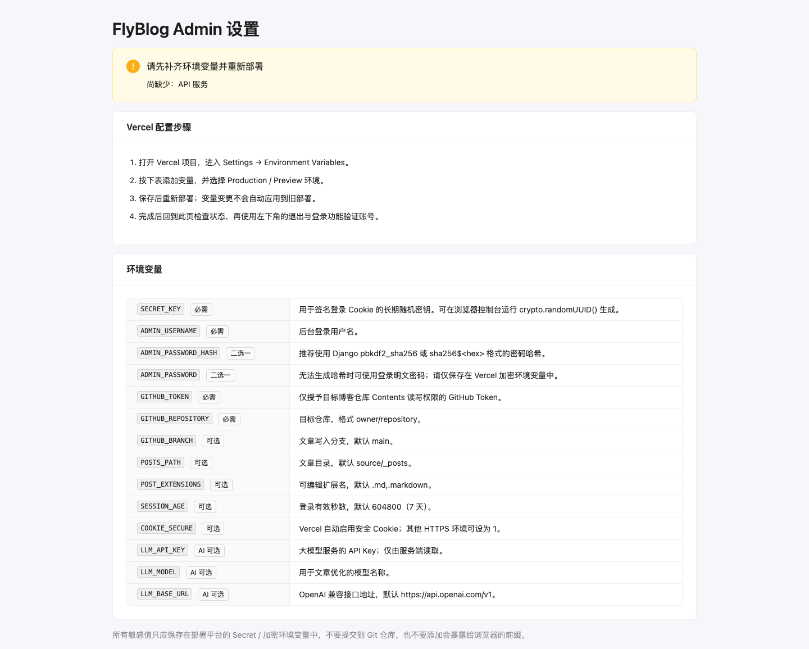

# FlyBlogAdmin

FlyBlogAdmin 是一个面向 Hexo 等 Git 仓库博客的无数据库管理后台。文章直接通过 GitHub Contents API 读取和提交，前端使用 React、TypeScript 与 Ant Design，服务端使用 Vercel Node.js Functions。项目完全使用 Node.js/TypeScript，不包含 Python 或 Django 运行时。API 按功能合并入口以控制 Serverless Function 数量，同时避免刷新或无痕访问时被前端路由误接管。

首次访问时，必需环境变量未齐全会一直显示设置引导页；配置齐全并重新部署后进入登录页。设置页会逐项显示必需与可选变量的实际配置状态。
设置页内置仅在浏览器本地运行的 `SECRET_KEY` 与 `ADMIN_PASSWORD_HASH` 生成器，并提供细粒度 `GITHUB_TOKEN` 的创建和最小权限配置教程。
AI 接口变量始终是可选项，不参与引导页判断；即使完全不配置 AI，也可以正常登录并管理文章。

[](https://vercel.com/new/clone?repository-url=https%3A%2F%2Fgithub.com%2Fxieqifei%2FFlyBlogAdmin&env=SECRET_KEY,ADMIN_USERNAME,ADMIN_PASSWORD,GITHUB_TOKEN,GITHUB_REPOSITORY&envDescription=FlyBlogAdmin%20%E8%BF%90%E8%A1%8C%E6%89%80%E9%9C%80%E7%9A%84%E7%99%BB%E5%BD%95%E4%B8%8E%20GitHub%20%E9%85%8D%E7%BD%AE&project-name=fly-blog-admin&repository-name=fly-blog-admin)



## 功能

- 首页内容看板：文章、分类、标签统计及最近文章。
- 文章支持标题、分类和标签搜索及多列排序；编辑保存时自动刷新编辑时间。
- Obsidian 风格单栏实时预览编辑器支持准确的长文光标定位、浅色语法高亮、表格即时预览与行列编辑、Markdown 工具栏、快捷键及浏览器草稿恢复。
- 首次发布时自动写入发布日期，每次保存时自动刷新编辑日期，均精确到秒且不在编辑器中手动修改（旧文章缺少时间时补为 `00:00:00`）；列表只展示日期。
- Obsidian 风格文章关系图谱，支持拖拽、缩放、筛选和局部图谱。
- 可选 AI 文章校对与改写，先对比预览再手动应用，不会自动覆盖文章。
- 单管理员 Cookie 登录及环境变量配置引导。
- 响应式布局，可在桌面和手机浏览器使用。

## 本地运行

需要 Node.js 22 和 npm。

```bash
git clone https://github.com/xieqifei/FlyBlogAdmin.git
cd FlyBlogAdmin
npm install
npm run dev
```

Vite 开发服务器默认地址为 `http://localhost:5173`。它只启动前端，因此会停留在设置引导页；验证登录、文章读写等完整功能时，请使用 `npx vercel dev` 启动前端和 `/api` Node Function，并提供下列环境变量。

执行生产构建：

```bash
npm run build
npm run preview
```

构建产物位于 `dist`。`npm test` 会执行 TypeScript 类型检查。

## 环境变量

| 变量 | 必需 | 说明 |
| --- | --- | --- |
| `SECRET_KEY` | 是 | 登录 Cookie 签名密钥，请使用长期随机值 |
| `ADMIN_USERNAME` | 是 | 管理员用户名 |
| `ADMIN_PASSWORD_HASH` | 二选一 | 推荐，支持 Django `pbkdf2_sha256` 或 `sha256$<hex>` |
| `ADMIN_PASSWORD` | 二选一 | 管理员明文密码，仅应存放在部署平台的加密变量中 |
| `GITHUB_TOKEN` | 是 | 对目标仓库具有 Contents 读写权限的细粒度 Token |
| `GITHUB_REPOSITORY` | 是 | 目标博客仓库，格式为 `owner/repository` |
| `GITHUB_BRANCH` | 否 | 文章分支，默认 `main` |
| `POSTS_PATH` | 否 | 文章目录，默认 `source/_posts` |
| `POST_EXTENSIONS` | 否 | 可编辑扩展名，默认 `.md,.markdown` |
| `SESSION_AGE` | 否 | 登录有效秒数，默认 7 天 |
| `LANGUAGE` | 否 | 界面语言：`zh`、`en` 或 `de`，默认 `zh` |
| `LLM_API_KEY` | AI 可选 | OpenAI 兼容大模型服务的 API Key |
| `LLM_MODEL` | AI 可选 | 模型名称 |
| `LLM_BASE_URL` | AI 可选 | 接口根地址，默认 `https://api.openai.com/v1` |
| `LLM_API_STYLE` | AI 可选 | `auto`、`chat` 或 `responses`，默认自动兼容 |
| `S3_ENDPOINT` | 图床可选 | 手动填写完整的 S3 兼容端点 |
| `S3_ACCESS_KEY_ID` | 图床可选 | R2 API Token 的 Access Key ID |
| `S3_SECRET_ACCESS_KEY` | 图床可选 | R2 API Token 的 Secret Access Key |
| `S3_BUCKET` | 图床可选 | 编辑器拖拽图片时使用的默认存储桶 |
| `S3_PUBLIC_URL` | 图床可选 | 图片公开访问基础地址（自定义域名或 `r2.dev` 地址） |

不要把 Token、密码或密钥提交到仓库，也不要为这些变量添加会将其暴露到浏览器的 `VITE_` 前缀。

## 部署到 Vercel

### 一键导入

点击文首的 **Deploy with Vercel** 按钮，Vercel 会克隆本仓库并提示填写必需变量。部署完成后打开站点；若配置不完整，设置引导页会列出缺少的变量。

### 手动导入

1. 在 Vercel 新建项目并导入此 GitHub 仓库。
2. Framework Preset 可保持自动检测；仓库中的 `vercel.json` 已指定 `npm run build` 和 `dist`。
3. 在 Settings → Environment Variables 中添加必需变量，并应用到 Production 和需要使用的 Preview 环境。
4. 重新部署。环境变量变更不会自动进入已经完成的旧部署。
5. 打开站点登录，确认文章列表能够从目标博客仓库载入。

推送到连接的 GitHub 分支后，Vercel 会按项目的 Git 集成设置自动创建新部署。本项目不需要数据库，也不会在 Serverless Function 的临时磁盘中保存文章。

## AI 优化工作流

配置 `LLM_API_KEY` 和 `LLM_MODEL` 后，在文章编辑页面中选择“AI 优化”。可选择生成标题和内容、校对、改善结构、精简内容或优化大纲，并补充自定义要求。系统会展示原文和建议稿；只有点击“应用到文章”后，建议才进入编辑器，仍需再次点击“保存并提交”才会写入 GitHub。

这一流程借鉴 Obsidian Smart Composer 的 Apply Edit 与提示模板体验：让用户控制上下文、预览建议并明确应用，而不是让模型直接改写远端文件。

## Cloudflare R2 图床

配置 `S3_ENDPOINT`、`S3_ACCESS_KEY_ID` 和 `S3_SECRET_ACCESS_KEY` 后，左侧“图床”会通过标准 AWS S3 SDK 自动读取存储桶，支持上传、浏览、复制 Markdown 链接和删除图片。建议同时设置 `S3_BUCKET` 与 `S3_PUBLIC_URL`；编辑器会把拖入或粘贴的图片上传到默认桶，并在光标处插入 Markdown 图片链接。

## 安全说明

- 使用只授权目标博客仓库的细粒度 GitHub Token。
- 优先使用 `ADMIN_PASSWORD_HASH`，并定期轮换 Token 与密钥。
- 服务端会校验写请求来源、文章相对路径和当前 GitHub blob SHA，避免跨站写入、路径穿越及静默覆盖远端新版本。
- AI 功能会把当前文章发送到配置的大模型服务；敏感文章应先确认服务商的数据处理政策。

## License

本项目沿用仓库中的 GPL-3.0 许可证。
